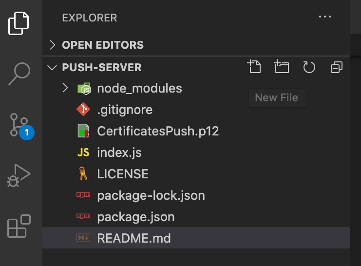
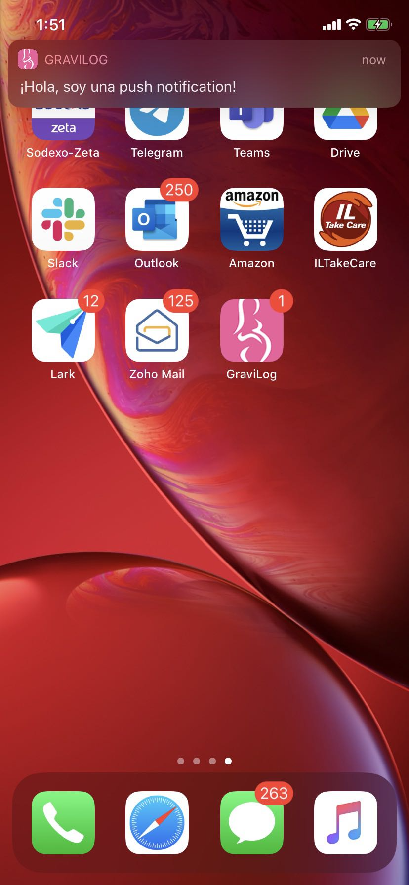

# Push Server

Send remote notifications to iOS devices.

[![Node.js][nodejs-image]][nodejs-url]
[![npm Version][npm-image]][npm-url]
[![Build Status][travis-image]][travis-url]
[![License][license-image]][license-url]
[![Platform][platform-image]][remote-notification-url]


## Version

15.0

## Prerequisites

- Node.js 15.0 or later
- NPM 6.14 or later
- macOS 10.15 or later
- Visual Studio Code 1.52 or later


## 1. Script creation
This sample is written in Node.js.
We need:
- A p12 file, which we’ll use to have a secure connection with APNs
- The device token, which will help us to send push notifications to this physical device.
So we’re ready to create our program on Node.js to send push notifications:
We open terminal app and create an empty folder called `push-server`, navigate into and open VS Code:
```
mkdir push-server
cd push-server
code .
```
From a terminal, just type:
```
npm init
```
Answer the questions in the terminal questionnaire.
It'll create a `package.json` file to your package to make it easy to manage and install dependencies.

From the File Explorer toolbar, press the New File button:


and name the file `index.js`.

VS Code has an integrated terminal which you can use to run shell commands. You can run Node.js directly from there.
- `View > Terminal` will open the integrated terminal and you can type ```npm install apn``` there.
This will install the needed module in charge of managing all the stuff related with APNs connection.
- We copy the p12 file (in my case `CertificatesPush.p12`) to the same folder of our Node.js script.
- We create the script with content in `index.js` where we replace `device-token` and `p12-password` by our own device token and the password that we used on the p12 file previously.

## 2. Run program

- To test all of this we go to the terminal, we type 
```
node index.js
``` 
and we wait so the push can arrive to our device:



- we instantiate the `Provider` object, create the `Notification` one and we send with the `send()` method. When we have the response (also for an error), we finish the execution.


## License

Distributed under the MIT license. See `LICENSE` for more information.

[LICENSE](LICENSE)

[npm-image]: https://img.shields.io/badge/npm-v6.14.9-blue
[nodejs-image]: https://img.shields.io/badge/node.js-v15-green
[nodejs-url]: https://nodejs.org/en/
[npm-url]: https://www.npmjs.com/
[license-image]: https://img.shields.io/badge/License-MIT-blue.svg
[license-url]: LICENSE
[travis-image]: https://img.shields.io/appveyor/ci/parshap/check-node-version/master.svg?style=flat-square
[travis-url]: https://travis-ci.org/dbader/node-datadog-metrics
[platform-image]: https://img.shields.io/badge/platform-iOS-blue
[remote-notification-url]: https://developer.apple.com/documentation/usernotifications/setting_up_a_remote_notification_server

